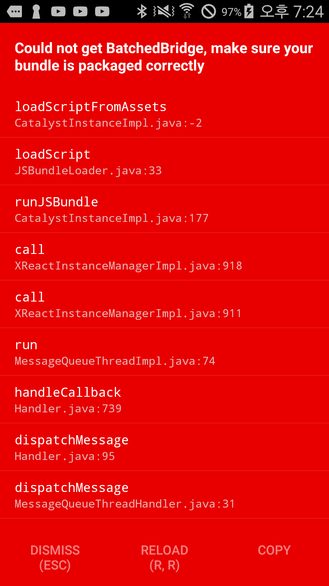
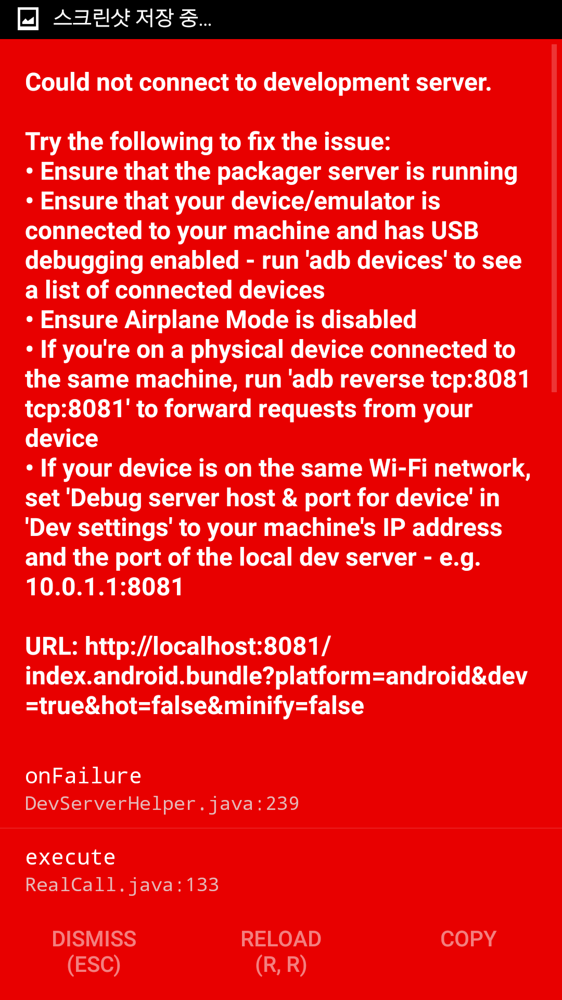

ㅈㅂ 개발자의 리액트 네이티브 도전기

installation
===============

환경: Ubuntu 16.04 LTS
IDE: WebStorm 2016.2.4
대상OS: Android

[요기](https://facebook.github.io/react-native/docs/getting-started.html) 보고 함.

역시나 안됨
========

시키는 대로 하고

<pre><code>react-native run-android</code></pre>

누르고 익숙하게 보던 안드로이드 빌드가 끝나면..

    </img>

행여나 하는 마음에 RELOAD(R,R)을 눌러보지만

    </img>

삽질 시작
=======

패키징 서버
------

첫번째로 MAC 에서는

<pre><code>react-native run-android</code></pre>

코드를 실행하면 자동으로 패키징 서버를 띄워준다. 하지만 우분투에서는

<pre><code>Starting JS server...
Running /home/harry/Android/Sdk/platform-tools/adb -s 43008f214c953133 reverse tcp:8081 tcp:8081
Building and installing the app on the device (cd android && ./gradlew installDebug...</code></pre>

라고 뜨지만 실제론 실행되지 않는다.

<pre><code>react-native start</code></pre>

백그라운드로 돌리고 싶다면

<pre><code>react-native start &</code></pre>

해주고 시작하면...

    </img>

adb
---
빌드 중,

<pre><code>adb server version(32) doesn't match this client (36) killing...</code></pre>

과 같은 에러가 뜬다.
구글링을 통해 안드로이드 스튜디오의 SDK Manager 를 통해 최신 build tool 로 업그레이드... 해도 마찬가지.
이유는 실제 

<pre><code>~/Android/Sdk/platform-tools/adb</code></pre>

를 봐야되는데

<pre><code>~/usr/bin/adb</code></pre>

를 보고 있고, 얘가 버전이 낮다는 것이다.
간단하게 심벌릭 링크로 이어주거나, 그냥 adb 파일을 복사해도 무관하다.
다시 실행하면 adb version 어쩌구.. 가 뜨지 않는다. Olleh!!

드디어 정상적인 화면 Get!

Test
====

Jest
----

React, React Native 는 Jest 를 쓰는 모양이다. 이제까지 Jasmine 을 많이 이용했던 모양인데,
Jest 는 Jasmine 을 대체할 거라는 계획을 홈페이지에 적어놓은 것을 볼 수 있다.
[요기](https://facebook.github.io/jest/docs/tutorial-react-native.html#content) 를 보고 설치.

문제 없이 실행된다.
  
Jest 테스트는 매우 흥미로운데, 테스트하고자 하는 컴포넌트(Component)의 스냅샷을 떠놓고 코드가 돌면서 생성한 스냅샷과
이미 생성되어 있는 스냅샷을 비교한다. 만약 테스트가 깨진다면 스냅샷을 업데이트한다. 

<pre><code>jest -u</code></pre>

그래도 깨진다면, 뭔가가 잘못 되었다는 뜻이다. 
